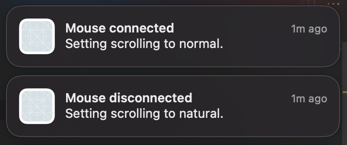

# ScrollDirector

A macOS application to toggle natural scrolling when a mouse is connected or disconnected.

## Will this project ever be on the App Store?

Unfortunately, no. We link against the `PreferencesPaneSupport` private framework, and Apple doesn't like people using private frameworks on the App Store.

## License

This project is licensed under the [MIT](https://choosealicense.com/licenses/mit/) license.
